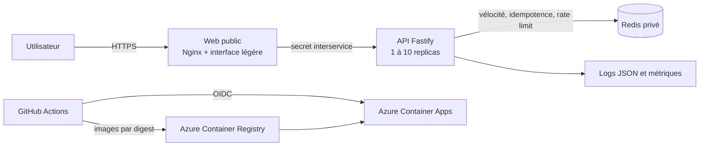

# Transaction Risk Gate

[](https://github.com/ghassenzaouali/transaction-risk-gate/actions/workflows/ci.yml)
[](https://sonarcloud.io/dashboard?id=ghassenzaouali_transaction-risk-gate)

Application de démonstration qui attribue à une transaction synthétique une décision explicable :
`APPROVED`, `REVIEW` ou `REJECTED`. Le périmètre est volontairement petit ; l’objectif principal est
de démontrer comment concevoir, tester, sécuriser, livrer et exploiter un service cloud.

## État vérifié

| Élément                   | État                                                                              |
| ------------------------- | --------------------------------------------------------------------------------- |
| Domaine et API            | implémentés et testés                                                             |
| Couverture (lignes)       | API 95,29 %, domaine 99,20 %, web 99,51 %                                         |
| SonarCloud, Snyk et Trivy | bloquants et verts sur toute PR vers une branche durable                          |
| Images Docker et Compose  | images non-root, smoke local validé                                               |
| Déploiement Azure         | OIDC, ACR par digest, promu jusqu'en production, smoke testé à chaque étape       |
| Charge et panne           | k6 baseline/scale/stress 0 % d'erreur sur Azure ; panne Redis et rollback validés |

Les résultats réels sont consignés dans [les tests de charge](docs/test-charge.md),
[les scénarios de panne](docs/test-panne.md) et [les preuves de livraison](docs/livraison.md).

Production : <https://trg-web.agreeablegrass-4df52008.swedencentral.azurecontainerapps.io>.
Intégration :
<https://trg-web-integration.agreeablegrass-4df52008.swedencentral.azurecontainerapps.io>.

Préproduction et production sont déployées par promotion du même digest depuis `release/*` et
`main`, sans reconstruction.

## Architecture



Le navigateur ne reçoit jamais `API_KEY`. Nginx l’injecte vers l’API interne. Redis fournit l’état
partagé nécessaire aux replicas. S’il est indisponible, aucune transaction ne peut être approuvée :
le service force `REVIEW`, `degraded: true` et rend l’incident observable.

La [documentation d’architecture](docs/architecture.md), les [ADR](docs/decisions/) et le
[modèle métier](docs/metier.md) expliquent les décisions et leurs compromis.

## Démarrage local

Prérequis : Git, Docker Desktop avec Compose, Node.js 22 ou plus récent pour les outils locaux.

```powershell
Copy-Item .env.example .env
docker compose up --build --detach
```

Ouvrir <http://localhost:8080>. Vérifier ensuite :

```powershell
Invoke-WebRequest http://localhost:8080/healthz
Invoke-RestMethod http://localhost:8080/ready
Invoke-RestMethod http://localhost:8080/api/rules
```

Arrêt récupérable :

```powershell
docker compose down
```

Les valeurs de `.env.example` servent uniquement au développement local. `.env` est ignoré par Git.

## API et démonstration

- contrat de référence : [OpenAPI 3.1](docs/api/openapi.yaml) ;
- démonstration : [collection Postman](docs/postman/transaction-risk-gate.postman_collection.json) ;
- environnements Postman : [local](docs/postman/local.postman_environment.json) et
  [cloud](docs/postman/cloud.postman_environment.json) ;
- interface : scénarios APPROVED, REVIEW et REJECTED, règles actives et replicas observés.

Les routes métier sont `POST /api/decisions` et `GET /api/rules`. `GET /health`, `GET /ready` et
`GET /metrics` servent au cycle de vie et à la supervision de l’API interne.

## Qualité et sécurité

```powershell
npm ci
npm --prefix api ci
npm --prefix web ci
npm run format:check
npm run docs:lint
npm run governance:test
npm run operations:test
npm --prefix api run build
npm --prefix api run test:coverage
npm --prefix api run test:coverage:domain
npm --prefix web run test:coverage
pre-commit run --all-files
```

La CI refuse le merge si format, TypeScript strict, tests, couverture minimale de 80 %, cible métier
de 90 %, Gitleaks, SonarCloud, Snyk, construction Docker ou Trivy échouent. Les actions GitHub et
images de base sont épinglées, les permissions sont minimales et aucun contrôle obligatoire n’est
toléré en échec.

Voir [stratégie de tests](docs/tests.md), [sécurité](docs/securite.md) et
[quality gates](docs/governance/quality-security-gates.md).

## Charge, résilience et exploitation

Le workflow manuel **Tests de charge** cible uniquement `integration` ou `preproduction` :

- `baseline` : cinq utilisateurs virtuels pendant 30 secondes ;
- `scale` : montée progressive jusqu’à 150 utilisateurs ;
- `stress` : montée jusqu’à 300 utilisateurs pour rechercher la limite.

Chaque profil exige erreurs `< 1 %` et checks `> 99 %`. Les budgets p95/p99 sont respectivement
`250/500 ms` pour `baseline`, `750/1000 ms` pour `scale` et `1250/1750 ms` pour `stress`. Les deux
derniers exigent au moins deux `X-Instance-Id` et vérifient que la vélocité partagée se déclenche
malgré la distribution des requêtes.

Le scénario local de panne Redis est reproductible :

```powershell
node scripts/failure/redis-outage.mjs
```

Il arrête Redis, exige une décision fail-safe, redémarre Redis et attend le retour au mode normal.
L’exploitation, les métriques, alertes et requêtes Log Analytics sont détaillées dans
[le guide d’exploitation](docs/exploitation.md).

## Livraison et Git

Le flux exercé est :

```text
feat|fix|security|test|docs|ci/TRG-N-* -> develop -> release/vX.Y.Z -> main -> tag vX.Y.Z
```

Chaque étape utilise une PR, des labels `type`, `risk`, `area` et `release`, des branches protégées
et des checks obligatoires. `develop` construit puis publie une fois les images validées. Les
branches `release/*` et `main` promeuvent exactement les mêmes digests vers préproduction puis
production. Le smoke test déclenche un rollback contrôlé en cas d’échec.

Voir [politique Git](docs/governance/git-policy.md),
[politique de release](docs/governance/release-policy.md) et
[livraison/rollback](docs/livraison.md).

## Limites et usage de l’IA

Ce projet n’est pas un système antifraude réel : règles heuristiques, EUR uniquement, aucune
authentification utilisateur et aucune conservation durable des décisions. Les limites complètes et
leurs conséquences figurent dans [limites](docs/limites.md).

L’IA a été autorisée pour cet exercice et utilisée comme partenaire d’implémentation, de revue et de
documentation. Les choix ont été discutés, chaque changement reste traçable dans Git et aucune
sortie n’est acceptée sans tests, quality gates et vérification humaine. L’usage de l’IA ne remplace
ni la responsabilité de l’auteur, ni la revue, ni les preuves d’exécution.
