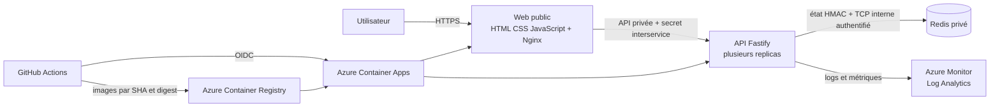
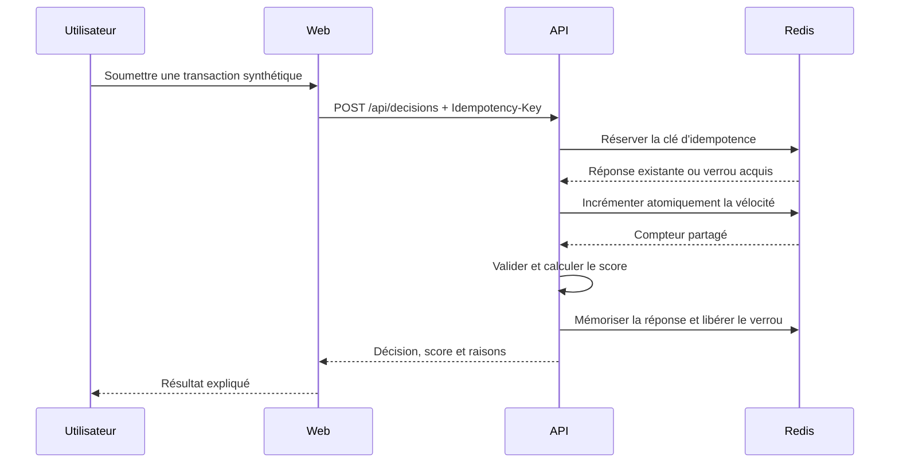

# Architecture générale

## Objectif

Transaction Risk Gate reçoit une transaction synthétique, applique des règles heuristiques
expliquées et retourne `APPROVED`, `REVIEW` ou `REJECTED`. Le projet démontre surtout la
construction d’un petit service exploitable : sécurité, cohérence multi-replica, tests,
observabilité et livraison.

## Vue des conteneurs

Le navigateur ne reçoit jamais le secret interservice. Nginx sert l’interface et relaie `/api/*`
vers l’API privée en injectant ce secret côté serveur.

## Responsabilités

| Élément | Responsabilité                                       | Exposition        |
| ------- | ---------------------------------------------------- | ----------------- |
| Web     | formulaire, scénarios, restitution explicable        | publique en HTTPS |
| API     | validation, règles, sécurité, idempotence, métriques | privée            |
| Redis   | vélocité et idempotence partagées avec TTL           | privée            |
| ACR     | images immuables identifiées par digest              | authentifiée      |
| Monitor | logs structurés, métriques et alertes                | opérateurs        |

## Flux d’une décision

Si Redis est indisponible, l’API ne peut pas prouver la vélocité globale. Elle reste disponible mais
force `REVIEW` avec `degraded=true`; elle ne produit jamais `APPROVED` dans cet état.

## État d’implémentation

TRG-2 sépare le moteur métier pur du cas d’usage qui obtient la vélocité. TRG-3 remplace l'état
local par Redis pour la vélocité et l'idempotence, ajoute un circuit breaker et formalise le mode
dégradé. TRG-4 durcit les frontières HTTP, partage le rate limiting, structure les logs et métriques
et teste la redaction. TRG-5 livre le simulateur web sans exposer de secret ni de flux global des
décisions. TRG-6 impose couverture, SonarCloud, Snyk, Gitleaks et Trivy. TRG-7 rend les images
non-root, décrit les trois environnements logiques et fournit l'IaC Azure idempotente. Le workflow
TRG-8 publie les images déjà scannées, promeut les mêmes digests et restaure les révisions
précédentes lorsqu'un smoke test échoue. TRG-9 fournit OpenAPI, Postman, les profils k6 et les
runbooks de panne. La performance ne devient une preuve qu'après un run réel ; un déploiement cloud
n'est déclaré réussi qu'avec son exécution GitHub verte.
