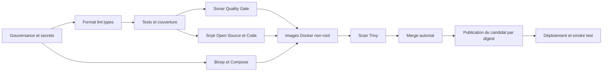

# Quality, Security and Test Gates

## Principes

1. Les tests prouvent le comportement ; la couverture révèle les zones non testées mais ne remplace
   pas les assertions utiles.
2. Les frontières sensibles exigent des tests positifs, négatifs, de concurrence et de panne.
3. Les contrôles obligatoires échouent si l’outil ou sa configuration manque.
4. Les hooks accélèrent le retour local ; la CI reste l’autorité.
5. Les rapports ne contiennent ni secret ni donnée bancaire.
6. Un test instable est un défaut, pas une raison d’ajouter un retry caché.

## Typologie des tests

| Suite             | But                                     | Exécution minimale               |
| ----------------- | --------------------------------------- | -------------------------------- |
| unitaire          | règles et politiques pures              | pre-push, PR, branches protégées |
| API               | validation, auth, erreurs et headers    | PR, branches protégées           |
| intégration Redis | atomicité, TTL, concurrence, panne      | PR concernée, release            |
| web               | formulaire, scénarios et restitution    | PR, branches protégées           |
| contrat           | conformité OpenAPI                      | PR concernée, branches protégées |
| résilience        | timeout, circuit breaker, shutdown      | PR concernée, release            |
| smoke             | application réellement déployée         | après déploiement                |
| charge            | latence, erreurs, replicas et cohérence | manuel, préproduction, release   |

Les tests utilisent horloges, identifiants et données synthétiques déterministes. Aucun test rapide
ne dépend d’Internet ou d’un environnement partagé.

## Couverture

| Portée                    |           Lignes |         Branches |
| ------------------------- | ---------------: | ---------------: |
| code de production global |          >= 80 % |          >= 80 % |
| code nouveau ou modifié   |          >= 80 % |          >= 80 % |
| domaine de décision       | objectif >= 90 % | objectif >= 90 % |

Seuls les fichiers générés vérifiés et un bootstrap trivial peuvent être exclus. Une exclusion
nécessite une justification et une review. Un test créé uniquement pour exécuter une ligne sans
vérifier son résultat est refusé.

Les commandes bloquantes sont `npm run test:coverage --prefix api` et
`npm run test:coverage --prefix web`. Le domaine possède en plus une porte renforcée à 90 % via
`npm run test:coverage:domain --prefix api`. Les exclusions versionnées sont limitées à :

- `api/src/decision.ts`, contrat TypeScript sans code exécutable ;
- `api/src/server.ts`, composition root vérifiée par build, smoke tests et test SIGTERM ;
- `web/dev-server.mjs`, outil local absent de l’image de production.

## SonarCloud

L’analyse est obligatoire sur toutes les PR vers `develop`, `release/*` et `main`. Une analyse de la
branche principale Sonar est aussi exécutée après chaque merge dans `main`.

| Mesure du nouveau code | Seuil   |
| ---------------------- | ------- |
| bugs                   | 0       |
| vulnérabilités         | 0       |
| reliability rating     | A       |
| security rating        | A       |
| maintainability rating | A       |
| hotspots revus         | 100 %   |
| couverture             | >= 80 % |
| lignes dupliquées      | < 3 %   |

La CI génère LCOV avant l’analyse et attend explicitement le Quality Gate. Un token, une
organisation ou un projet absent fait échouer le job obligatoire. SonarQube for IDE utilise le
connected mode sans token versionné.

Le projet utilise l'offre gratuite SonarQube Cloud : elle permet l'analyse de la branche principale
et des PR, mais pas l'analyse directe de plusieurs branches. `main` reste donc la branche principale
du projet Sonar, comme sur GitHub. Les branches durables n'introduisent aucun code directement :
leur PR est analysée et bloquée, puis elles promeuvent le même candidat immuable déjà validé. Le job
`SonarCloud` reste obligatoire sur les pushes `develop` et `release/*` et confirme explicitement
cette provenance, sans lancer une fausse analyse de branche non prise en charge par l'abonnement.

Le dépôt partage l’identité publique du projet dans `.sonarlint/connectedMode.json` et recommande
l’extension dans `.vscode/extensions.json`. Chaque développeur conserve son propre jeton dans son
éditeur ; le fichier partagé ne contient aucune authentification.

## Sécurité

| Surface            | Outil                       | Règle bloquante                       |
| ------------------ | --------------------------- | ------------------------------------- |
| secrets source     | Gitleaks et Push Protection | tout secret vérifié                   |
| dépendances        | Snyk Open Source            | Critical ou High exploitable          |
| code               | Snyk Code et Sonar          | Critical ou High exploitable          |
| images             | Trivy                       | Critical ou High exploitable          |
| IaC et topologie   | Bicep et Docker Compose     | compilation ou configuration invalide |
| dépendances GitHub | Dependabot                  | alerte triée et corrigée selon risque |
| provenance         | SHA, digest et métadonnées  | mapping absent ou mutable             |

Les constats Medium reçoivent une analyse, un propriétaire et une échéance. Une exception précise
justification, portée, compensation, approbateur et expiration ; elle ne peut jamais couvrir une
fuite de secret ou un fail-open.

Snyk utilise `SNYK_ORG` pour attribuer explicitement les tests à l’organisation préparée. Le CLI
exécute `test --all-projects` et `code test` sur chaque PR, puis `monitor` uniquement après un push
sur une branche durable. Trivy couvre les deux images et bloque les vulnérabilités HIGH ou CRITICAL
pour lesquelles un correctif existe ; les constats amont non corrigibles restent visibles et sont
réévalués par Dependabot.

## Étages des contrôles

### Pre-commit

- fin de fichier, espaces, LF et conflits ;
- validité JSON/YAML et conflits de casse ;
- fichiers volumineux et clés privées ;
- Gitleaks sur les changements indexés ;
- Markdown et liens documentaires ;
- politique de structure du dépôt.

### Pre-push

- nom et upstream de branche ;
- interdiction des références protégées ;
- diff sans erreur d’espace ;
- tests des règles de gouvernance ;
- build API et tests API/web rapides.

### CI de PR

Le flux cible est :

Les jobs indépendants peuvent fonctionner en parallèle, mais aucune image ou release n’est acceptée
sans toutes les preuves applicables. La publication recharge exactement l'artefact Docker scanné ;
elle ne reconstruit pas les images après Trivy. Un smoke test rouge déclenche le rollback et laisse
le workflow rouge.

## Rapports

Les détails vivent dans GitHub Actions, SonarCloud et Snyk. Git conserve les politiques, décisions
et résumés de release, pas un export daté après chaque commit. Les artefacts CI sont expurgés et
possèdent une rétention limitée.
