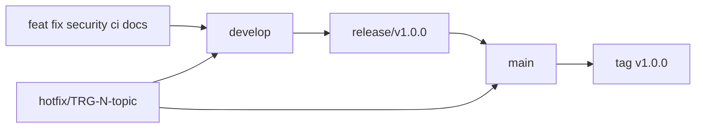

# Politique de release

## Versionnement

Le projet suit Semantic Versioning :

- `MAJOR` pour une rupture de contrat ;
- `MINOR` pour une fonctionnalité compatible ;
- `PATCH` pour une correction compatible.

La première version visée est `v1.0.0`. Un tag publié n’est jamais déplacé ou réutilisé ; une
correction produit une nouvelle version.

## Flux des branches



| Branche     | Rôle                                 | Déploiement          |
| ----------- | ------------------------------------ | -------------------- |
| travail     | changement isolé en PR               | aucun                |
| `develop`   | intégration continue                 | intégration          |
| `release/*` | stabilisation sans nouvelle fonction | préproduction        |
| `main`      | état publiable                       | production contrôlée |
| `hotfix/*`  | correction urgente depuis `main`     | après validation     |

## Construction et promotion

```text
commit accepté
-> images api/web taguées par SHA
-> scans et smoke tests
-> résolution des digests immuables
-> promotion des mêmes digests
-> tag SemVer et GitHub Release
```

Une release ne reconstruit jamais un artefact différent après validation. Le tag `latest` peut
exister comme alias humain hors promotion, mais ne constitue jamais une entrée de déploiement ou de
rollback.

Le candidat publié depuis `develop` est décrit dans `.release/manifest.json` lors de la création de
`release/vX.Y.Z`. Ce manifeste versionné associe la version SemVer, le SHA source et les deux
digests ACR. La CI refuse les champs supplémentaires, les références mutables, un registre inattendu
ou toute modification postérieure dans les contextes de construction `api/` et `web/`. Les fichiers
de procédure, d'infrastructure et de documentation peuvent être corrigés sans reconstruire les
images, mais restent soumis à l'ensemble des Quality Gates. La préproduction et la production
consomment ensuite le même manifeste.

## Critères d’admission

Avant la PR `release/* -> main` :

- CI, couverture, Sonar, Snyk, Gitleaks et Trivy verts ;
- régression complète ;
- smoke tests sur santé, readiness et décision métier ;
- scénarios de charge et de panne applicables ;
- digests, commit et environnement enregistrés ;
- limites, rollback et notes de release à jour ;
- discussions ouvertes résolues et checks obligatoires verts.

La création d’un tag final suit l’acceptation de la PR et pointe vers le commit fusionné. GitHub
Release contient le résumé, les limites et les digests promus.

Le runbook détaillé, les responsabilités des workflows et le contenu du smoke test sont décrits dans
[Livraison, promotion et rollback](../livraison.md).

## Rollback

Le rollback sélectionne la révision Azure précédente associée à un digest déjà accepté. Il ne
reconstruit pas le code. Après rollback :

1. vérifier `/health` et `/ready` ;
2. exécuter une décision synthétique ;
3. confirmer erreurs, latence et état Redis ;
4. documenter l’incident et ouvrir un correctif `TRG-N` ;
5. réintégrer tout hotfix dans `develop`.

## Échec d’une release

Un test, scanner, déploiement ou smoke test rouge rejette le candidat. La révision de production
précédente reste active. Une panne d’outil obligatoire n’est pas transformée en succès et aucune
exception silencieuse n’est permise.

## Preuves conservées

- SHA source et tag ;
- digests API et web ;
- résultats synthétiques de tests et couverture ;
- état des quality/security gates ;
- environnement, date et approbateur ;
- résultat des smoke tests et procédure de récupération.
