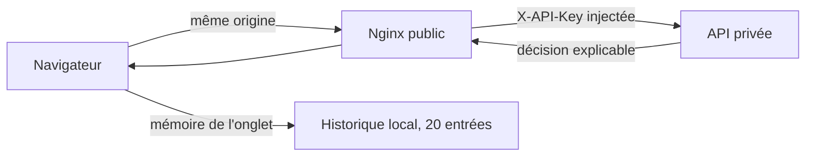

# Interface web de démonstration

## Objectif

Le simulateur rend le moteur compréhensible sans installer Postman. Il permet de saisir une
transaction synthétique, de charger trois scénarios, puis d'afficher le score et les raisons. Il
n'est ni un portail bancaire ni une interface de revue humaine réelle.

Le JavaScript du navigateur n'accède jamais à `API_KEY` ni à `LOAD_TEST_TOKEN`. Nginx écrase le
premier avec le secret serveur. Il relaie un éventuel header de charge vers l'API, qui reste seule à
connaître et comparer le secret hors production ; un token absent ou faux garde le plafond public.
Aucun secret n'existe dans le bundle statique ou dans le DOM.

## Parcours

1. L'interface charge `GET /api/rules` et affiche la politique réellement active.
2. L'utilisateur choisit un scénario ou saisit des valeurs.
3. Une validation accessible signale tous les champs incorrects avant l'appel.
4. `POST /api/decisions` reçoit une nouvelle `Idempotency-Key` et le payload EUR normalisé.
5. La décision affiche verdict, score, raisons, mode, identifiant et instant d'évaluation.
6. Le résultat rejoint un historique en mémoire, limité aux 20 entrées les plus récentes.

`GET /api/decisions` n'est jamais appelé et n'existe pas. Un autre navigateur ou replica ne peut
donc pas consulter l'historique de cet onglet.

## Scénarios déterministes

| Scénario               | Signaux principaux                                  | Résultat attendu |
| ---------------------- | --------------------------------------------------- | ---------------- |
| transaction habituelle | magasin, FR, montant faible, catégorie normale      | `APPROVED`       |
| contexte à vérifier    | pays hors liste et achat en ligne                   | `REVIEW`         |
| signaux cumulés        | pays, montant, catégorie sensible et achat en ligne | `REJECTED`       |

La vélocité n'est pas utilisée pour fabriquer ces trois exemples : leur résultat reste donc
compréhensible dès le premier clic. Des soumissions répétées permettent ensuite d'observer la règle
de vélocité réelle.

## États du service

L'interface interroge `/ready` toutes les cinq secondes et observe `X-Instance-Id` sur les réponses.

- **normal** : API prête et Redis disponible ;
- **dégradé** : API prête, Redis indisponible, décision forcée à `REVIEW` ;
- **indisponible** : readiness inaccessible ou non réussie.

Le nombre de replicas affiché représente les identifiants observés pendant les 30 dernières
secondes, pas une promesse sur la configuration Azure. Il sert de preuve pendant un test de charge.

## Accessibilité et sécurité du rendu

Les champs ont des labels, les erreurs sont reliées visuellement et le premier champ incorrect
reçoit le focus. Les changements d'état et erreurs utilisent des régions `aria-live`. Le clavier, le
contraste, le responsive et `prefers-reduced-motion` sont pris en compte.

Les données de l'API sont toujours insérées avec `textContent`, jamais `innerHTML`. La page reçoit
une CSP restrictive, des headers anti-frame/anti-sniff et `Cache-Control: no-store`.

## Tests

Les tests sans navigateur couvrent la normalisation, toutes les erreurs du formulaire, les trois
scénarios, la limite et l'isolation de l'historique, les headers de soumission, l'absence de clé API
côté client et les messages d'erreur. Les tests existants du suivi de replicas restent actifs.
