# Livraison, promotion et rollback

## Objectif

La chaîne de livraison sépare la validation du code, la publication d'artefacts et leur promotion.
Une image validée n'est jamais reconstruite entre l'intégration, la préproduction et la production.
La preuve relie donc sans ambiguïté un commit, deux digests ACR et un déploiement.

```mermaid
flowchart LR
    PR[PR vers develop] --> CI[CI complète]
    CI --> Images[Images scannées]
    Images --> ACR[Publication ACR par digest]
    ACR --> Integration[Déploiement intégration]
    Integration --> Manifest[Manifeste de promotion]
    Manifest --> Preprod[release vers préproduction]
    Preprod --> Production[main vers production]
    Production --> Tag[Tag et GitHub Release]
```



## Responsabilité des workflows

| Workflow                        | Déclencheur                    | Responsabilité                                                                  |
| ------------------------------- | ------------------------------ | ------------------------------------------------------------------------------- |
| `.github/workflows/ci.yml`      | PR et push sur branche durable | gouvernance, tests, quality gates, images, publication et choix de la promotion |
| `.github/workflows/deploy.yml`  | appel réutilisable ou manuel   | déploiement par digest, smoke test et rollback                                  |
| `.github/workflows/release.yml` | tag `v*.*.*`                   | validation du manifeste et création de la GitHub Release                        |

Les permissions sont déclarées au plus près des jobs. `id-token: write` n'est accordé qu'aux jobs
qui s'authentifient auprès d'Azure par OIDC. La création d'une GitHub Release est isolée du workflow
réutilisable afin qu'elle seule reçoive `contents: write` ; un appel de déploiement ne peut donc pas
augmenter silencieusement les droits transmis par la CI.

## Parcours des artefacts

### Intégration

Sur un push accepté dans `develop`, la CI :

1. construit les images API et web avec le SHA du commit ;
2. contrôle leur utilisateur, leur configuration et leurs vulnérabilités avec Trivy ;
3. empaquette exactement ces images dans un artefact temporaire ;
4. recharge cet artefact sans nouvelle construction ;
5. publie les images dans ACR et récupère leurs digests ;
6. déploie ces digests en intégration ;
7. exécute le smoke test et conserve la preuve de déploiement pendant 30 jours.

L'artefact d'images n'est conservé qu'un jour : ACR devient ensuite la source des blobs immuables.

### Préproduction et production

La branche `release/vX.Y.Z` ajoute `.release/manifest.json`, à partir du candidat déjà validé en
intégration. Le manifeste contient uniquement :

```json
{
  "version": "v1.0.0",
  "sourceSha": "0123456789abcdef0123456789abcdef01234567",
  "apiImage": "registry.azurecr.io/transaction-risk-gate-api@sha256:<digest>",
  "webImage": "registry.azurecr.io/transaction-risk-gate-web@sha256:<digest>",
  "createdAt": "2026-09-01T12:00:00Z"
}
```

La validation refuse un tag mutable, un registre différent, un SHA court ou un champ inattendu. Elle
refuse aussi toute modification des contextes de construction `api/` et `web/` après le commit
candidat : les digests ne pourraient plus représenter le code livré. Une correction de procédure,
d'infrastructure ou de documentation reste possible à condition de franchir tous les Quality Gates ;
elle ne modifie pas le contenu des images déjà scannées. `release/*` déploie le manifeste en
préproduction ; `main` déploie exactement les mêmes digests en production. Le tag correspondant
publie une GitHub Release qui rappelle le SHA et les deux digests.

## Smoke test

Le script `scripts/smoke/smoke-test.mjs` utilise uniquement Node.js et vérifie, avec des données
synthétiques :

- `/healthz` et `/ready` en mode normal avec Redis disponible ;
- le contrat des cinq règles, la devise EUR et une somme des poids égale à 100 ;
- une décision `APPROVED` ;
- le rejeu idempotent avec le même `decisionId` ;
- la présence de `X-Instance-Id`.

Le script n'envoie jamais la clé interservice : il traverse le web public, qui l'injecte uniquement
vers l'API privée. Hors `localhost`, il refuse une URL qui n'utilise pas HTTPS. Les tentatives sont
bornées à 180 secondes afin d'absorber le démarrage d'une nouvelle révision sans masquer une panne.

## Rollback

Avant chaque déploiement, le workflow mémorise les révisions actives API et web. Si le smoke test du
candidat échoue :

1. le trafic est renvoyé à 100 % vers les deux révisions précédentes ;
2. le smoke test est rejoué sur l'état restauré ;
3. le workflow reste rouge, même si le service est de nouveau sain.

Cette dernière règle empêche de présenter un candidat défaillant comme livré. Un opérateur peut
aussi déclencher manuellement `deploy.yml`, sélectionner l'environnement et soit préciser les deux
révisions, soit laisser `infra/rollback.sh` choisir les précédentes.

## Configuration externe

Les variables non sensibles restent au niveau du dépôt : noms Azure, région, registre, projet
SonarCloud, organisation Snyk et URL publique. Les identifiants OIDC Azure, `SONAR_TOKEN` et
`SNYK_TOKEN` sont des secrets du dépôt. Chaque GitHub Environment porte ses secrets runtime
distincts :

| Secret              | Intégration | Préproduction | Production |
| ------------------- | :---------: | :-----------: | :--------: |
| `API_KEY`           |     oui     |      oui      |    oui     |
| `REDIS_HMAC_SECRET` |     oui     |      oui      |    oui     |
| `REDIS_PASSWORD`    |     oui     |      oui      |    oui     |
| `LOAD_TEST_TOKEN`   |     oui     |      oui      |    non     |

L'absence volontaire de `LOAD_TEST_TOKEN` en production empêche le profil de charge privilégié sur
l'environnement public. GitHub peut toutefois utiliser le secret du dépôt lorsqu'un secret portant
le même nom est absent d'un Environment. Le workflow remplace donc explicitement cette valeur par
une chaîne vide en production. Le script de déploiement refuse en plus toute valeur non vide : ces
deux contrôles indépendants appliquent une défense en profondeur et bloquent le déploiement avant
toute mutation Azure si la règle est contournée.

Le projet SonarQube Cloud associé est `ghassenzaouali_transaction-risk-gate` et sa branche
principale reste `main`. Avec l'offre Free, les PR vers chaque branche durable sont analysées et
bloquées. Les pushes `develop` et `release/*` ne relancent pas une analyse multibranche indisponible
dans cette offre : ils confirment la provenance du candidat. `main` reçoit l'analyse de branche
principale et promeut le digest qui a déjà franchi les Quality Gates des PR.

## Preuves et limites

Chaque déploiement réussi produit un résumé GitHub et un fichier `deployment-evidence.json` avec
l'environnement, la version, le SHA, les digests, l'URL, la date et le résultat du smoke test. Ces
fichiers ne contiennent aucun secret.

<!-- À COMPLÉTER en TRG-8/TRG-9, à partir des runs réels de ce dépôt. -->

L'automatisation et ses tests locaux sont implémentés dans TRG-8. Consigner : le run CI qui publie
les images par digest et déploie l'intégration, le run qui promeut les mêmes digests en
préproduction depuis `release/*`, puis le run qui les déploie en production depuis `main` avec smoke
test sur l'URL publique «`PUBLIC_BASE_URL`».

La preuve production associe la version taguée au SHA source et aux digests immuables enregistrés
dans `.release/manifest.json`. Un hotfix de procédure ne modifie ni `api/` ni `web/` et ne
reconstruit donc pas les artefacts promus.
