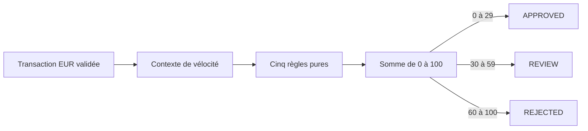

# Modèle métier de décision de risque

## Finalité

Transaction Risk Gate évalue une transaction synthétique avec cinq heuristiques déterministes. Il
retourne un score, une décision et les règles déclenchées. Ce comportement est explicable et
reproductible : les mêmes données, la même politique et le même contexte de vélocité produisent la
même décision.

Ce moteur démontre une architecture et des pratiques d’ingénierie. Il ne remplace pas un système
antifraude réel, un modèle statistique, une obligation réglementaire ou une décision humaine.

## Périmètre monétaire

La première version accepte uniquement `EUR`. Un seuil de montant absolu n’a de sens que dans une
devise connue. Accepter `USD`, `GBP` ou `CHF` avec le même nombre créerait des décisions
incohérentes à cause des taux de change et des valeurs différentes.

La frontière HTTP normalise `eur` en `EUR`, puis rejette toute autre devise. Une future prise en
charge multidevise nécessiterait une source de taux, une date de valorisation, une politique de
repli et des tests dédiés.

## Règles et poids

Les poids sont immuables dans cette version et totalisent exactement 100.

| Règle                       |   Poids | Déclenchement                                         |
| --------------------------- | ------: | ----------------------------------------------------- |
| `VELOCITY`                  |      30 | compteur de la carte strictement supérieur au seuil   |
| `COUNTRY_RISK`              |      25 | pays absent de la liste autorisée                     |
| `AMOUNT_THRESHOLD`          |      20 | montant strictement supérieur au seuil EUR            |
| `HIGH_RISK_MERCHANT`        |      15 | catégorie marchande présente dans la liste sensible   |
| `CARD_NOT_PRESENT`          |      10 | canal `online`, donc carte non présentée physiquement |
| **Risque maximal possible** | **100** | les cinq règles sont déclenchées                      |

Les comparaisons strictes évitent les ambiguïtés de frontière : un montant égal au seuil ne
déclenche pas `AMOUNT_THRESHOLD`, et un compteur égal au maximum autorisé ne déclenche pas
`VELOCITY`.

## Bandes de décision

| Score  | Décision   | Interprétation de démonstration                 |
| ------ | ---------- | ----------------------------------------------- |
| 0–29   | `APPROVED` | aucune combinaison n’atteint le seuil de revue  |
| 30–59  | `REVIEW`   | vérification humaine ou contrôle complémentaire |
| 60–100 | `REJECTED` | risque heuristique élevé                        |

Les bornes `0`, `29`, `30`, `59`, `60` et `100` sont testées directement. Le moteur refuse aussi un
score hors de `0–100` : une telle valeur indique une erreur de programmation ou de politique, pas
une décision valide.

## Exemples

### Transaction approuvée

Une transaction en magasin, sous le seuil, dans un pays autorisé et une catégorie normale ne
déclenche aucune règle : score `0`, décision `APPROVED`.

### Transaction en revue

Une quatrième transaction alors que `VELOCITY_MAX=3` déclenche `VELOCITY` : score `30`, décision
`REVIEW`.

### Transaction rejetée à la borne

Un pays hors liste (`25`), un montant au-dessus du seuil (`20`) et une catégorie sensible (`15`)
totalisent exactement `60` : décision `REJECTED`.

## Configuration active

Les seuils et listes sont fournis au démarrage. Ils n’ont aucun défaut métier silencieux : une
valeur absente ou invalide empêche l’application de démarrer.

| Variable                        | Validation principale                  |
| ------------------------------- | -------------------------------------- |
| `AMOUNT_THRESHOLD`              | nombre EUR fini, `> 0`, maximum `10^9` |
| `VELOCITY_MAX`                  | entier de `1` à `10 000`               |
| `VELOCITY_WINDOW_SECONDS`       | entier de `1` à `3 600`                |
| `ALLOWED_COUNTRIES`             | codes ISO alpha-2 uniques, non vides   |
| `HIGH_RISK_MERCHANT_CATEGORIES` | identifiants normalisés uniques        |

Les listes sont normalisées avant la détection des doublons. Par exemple, `FR,fr` est rejeté au lieu
de créer deux entrées apparemment différentes.

Les poids et bandes restent dans le code car ils constituent la version du modèle métier. Une
modification exige donc tests, review éventuelle, traçabilité Git et nouvelle release. Les rendre
dynamiques sans versionnement diminuerait la reproductibilité des décisions.

## Confidentialité et explicabilité

La réponse expose uniquement l’identifiant de décision, le verdict, le score, les noms de règles,
leurs poids et une explication générique. Les explications ne répètent jamais :

- `cardId` ou `transactionId` ;
- montant exact ;
- pays reçu ;
- catégorie marchande reçue ;
- payload complet.

La piste d’audit structurée suit la même politique et ne conserve que la preuve de décision. Le
contexte précis reste disponible pendant le traitement mais n’est pas recopié dans les logs.

## Séparation des responsabilités

`domain/risk-engine.ts` est pur : il ne connaît ni Fastify, ni Redis, ni horloge, ni réseau. Le cas
d’usage `application/evaluate-transaction.ts` obtient le compteur de vélocité puis appelle le
domaine. Cette séparation permet :

- des tests rapides et exhaustifs des règles ;
- l'utilisation de Redis sans coupler le calcul au stockage ;
- une politique de mode dégradé explicite et testable ;
- la preuve qu’une panne de dépendance ne fabrique pas silencieusement une approbation.

Redis incrémente le compteur partagé avant l'évaluation. La quatrième transaction déclenche donc la
règle lorsque `VELOCITY_MAX=3`, même si les quatre requêtes sont réparties entre plusieurs replicas.
La carte n'est jamais utilisée directement comme clé : un HMAC-SHA-256 non réversible la
pseudonymise. Le fonctionnement complet, les TTL et le mode dégradé sont décrits dans
[Résilience et cohérence Redis](redis.md).

## Limites actuelles

- Les règles sont heuristiques et non calibrées sur des données réelles.
- La fenêtre de vélocité est fixe, pas glissante.
- Redis conserve uniquement un état technique temporaire ; aucune piste métier durable n'est créée.
- Les seuils sont configurables au démarrage, mais pas modifiables dynamiquement.
- Aucune décision n’est conservée dans une base métier durable.
