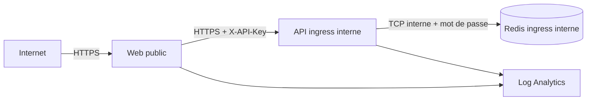

# Plateforme conteneurisée et Azure

## Séparation entre plateforme et livraison

Le provisionnement ne construit aucune image et ne déploie jamais `latest`. Deux templates Bicep
séparent les responsabilités :

| Template                  | Responsabilité                                                                    |
| ------------------------- | --------------------------------------------------------------------------------- |
| `infra/platform.bicep`    | ACR, Log Analytics, identité `AcrPull` et environnement Azure Container Apps      |
| `infra/apps.bicep`        | Redis, API et web pour un environnement logique, depuis deux digests déjà publiés |
| `infra/provision.sh`      | validation et déploiement idempotent de la plateforme                             |
| `infra/deploy-apps.sh`    | validation des entrées et déploiement d’un environnement logique                  |
| `infra/configure-oidc.sh` | bootstrap administrateur de la fédération GitHub–Azure                            |

Cette séparation évite le problème classique « l’IaC crée ACR et tente immédiatement de tirer une
image qui n’y existe pas encore ». TRG-8 publie une fois les images déjà scannées, récupère leurs
digests puis appelle le second template sans reconstruction.

## Environnements

Une plateforme physique est mutualisée pour limiter le coût. Les données et secrets ne le sont pas :
chaque environnement logique possède son propre trio Redis/API/web.

| Git durable | GitHub Environment | Noms Container Apps, exemple                                    |
| ----------- | ------------------ | --------------------------------------------------------------- |
| `develop`   | `integration`      | `redis-integration`, `api-integration`, `web-integration`       |
| `release/*` | `preproduction`    | `redis-preproduction`, `api-preproduction`, `web-preproduction` |
| `main`/`v*` | `production`       | `redis`, `api`, `web`                                           |

Le partage d’ACR, de Log Analytics et de l’environnement Container Apps est un compromis de coût.
Une production réelle séparerait au minimum les groupes de ressources et idéalement les abonnements.

Le SKU ACR Basic conserve un endpoint public authentifié : compte administrateur et pull anonyme
sont désactivés, les workloads utilisent l’identité `AcrPull` et la CI pousse par OIDC. Un registre
accessible uniquement par private endpoint nécessiterait ACR Premium et un réseau virtuel ; c’est
une évolution de production, pas une garantie simulée ici.

## Frontières réseau



Seul le web déclare `external: true`. L’API utilise l’ingress HTTP interne avec redirection HTTP
désactivée et Nginx appelle son FQDN en HTTPS. Redis utilise l’ingress TCP interne : les autres
Container Apps du même environnement peuvent le joindre par son nom, mais aucun endpoint public
n’est créé.

Redis est volontairement un conteneur mono-replica sans persistance : il porte uniquement des TTL de
vélocité et d’idempotence, pas une base métier durable. Un mot de passe fort est injecté comme
secret et écrit dans un fichier temporaire `0600` avant le démarrage de Redis. Le mot de passe
disparaît de l’environnement du processus. Cette option économique n’offre pas le SLA ni le
chiffrement TLS d’un service managé ; Azure Managed Redis avec private endpoint est l’évolution
recommandée pour une production bancaire réelle.

## Images et exécution

- les bases Node, Nginx unprivileged et Redis sont épinglées par digest ;
- les images applicatives portent le SHA Git dans les labels OCI ;
- Redis, l’API et le web s’exécutent avec des utilisateurs non-root ;
- Compose retire toutes les capabilities, impose `no-new-privileges` et des filesystems en lecture
  seule avec seulement `/tmp` en mémoire ;
- `.dockerignore` exclut dépendances, rapports, tests et fichiers `.env` du contexte ;
- `deploy-apps.sh` refuse toute référence ne finissant pas par `@sha256:<64 hex>` ;
- les secrets sont uniquement des `secretRef` Container Apps, jamais des `ARG`, `ENV` d’image ou
  outputs Bicep.

La CI compile Bicep, valide Compose, construit les images et inspecte leur utilisateur et leur
configuration avant Trivy.

## OIDC et permissions

Le tenant CESI interdit aux comptes étudiants de créer une App Registration. La fédération OIDC
utilise donc une identité managée affectée par l'utilisateur, propre au dépôt, avec trois
credentials fédérés créés de façon idempotente. Les sujets immuables incluent les identifiants
GitHub de l'organisation et du dépôt :

```text
repo:ghassenzaouali@139699856/transaction-risk-gate@1352445451:environment:integration
repo:ghassenzaouali@139699856/transaction-risk-gate@1352445451:environment:preproduction
repo:ghassenzaouali@139699856/transaction-risk-gate@1352445451:environment:production
```

Le workflow déclare `permissions: id-token: write` et le GitHub Environment correspondant. Azure
émet alors un jeton court ; aucun client secret permanent n’est stocké. L'identité de déploiement
reçoit `Owner` **uniquement** sur le groupe de ressources `rg-transaction-risk-gate`, jamais sur
l'abonnement : le pipeline provisionne la plateforme (ACR, Log Analytics, environnement Container
Apps) puis crée l'attribution `AcrPull` de l'identité runtime, ce qui exige la gestion des
attributions de rôle à ce périmètre. En production, `Role Based Access Control Administrator`
assorti d'une condition limitant les rôles assignables à `AcrPull` remplacerait `Owner` (voir
[limites](limites.md)). L'identité runtime distincte ne reçoit que `AcrPull` sur l'ACR.

## Commandes reproductibles

Prévisualiser puis appliquer la plateforme :

```bash
PROVISION_MODE=what-if bash infra/provision.sh
PROVISION_MODE=apply bash infra/provision.sh
```

Prévisualiser un déploiement applicatif après publication des images :

```bash
STAGE=integration \
API_IMAGE='registry.azurecr.io/transaction-risk-gate-api@sha256:<digest>' \
WEB_IMAGE='registry.azurecr.io/transaction-risk-gate-web@sha256:<digest>' \
API_KEY='<secret>' REDIS_HMAC_SECRET='<secret>' REDIS_PASSWORD='<64-128-hex>' \
LOAD_TEST_TOKEN='<secret>' DEPLOY_MODE=what-if \
bash infra/deploy-apps.sh
```

Les secrets d’exemple sont des placeholders et ne doivent jamais être ajoutés à l’historique du
shell, aux logs ou au dépôt. En CI, ils proviendront des GitHub Environments.

## État des preuves

Dans TRG-7, les deux templates compilent avec Bicep, Compose est validé statiquement et les images
sont reconstruites puis scannées dans la CI. TRG-8 ajoute publication ACR, déploiement OIDC, smoke
tests, manifeste de promotion, preuve par digest et rollback.

<!-- À COMPLÉTER en TRG-8, à partir des runs réels de ce dépôt : consigner le run CI qui confirme en
     intégration la publication ACR, la connexion OIDC, le déploiement Bicep, la résolution de l'URL,
     le smoke test et la preuve immuable ; puis les runs de promotion en préproduction et en
     production, tous appuyés sur le même manifeste de candidat, sans reconstruction d'image. -->
