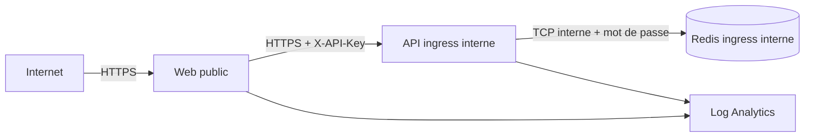

# Plateforme conteneurisée et Azure

## Séparation entre plateforme et livraison

Le provisionnement ne construit aucune image et ne déploie jamais `latest`. Deux templates Bicep
séparent les responsabilités :

| Template                  | Responsabilité                                                                    |
| ------------------------- | --------------------------------------------------------------------------------- |
| `infra/platform.bicep`    | ACR et identité `AcrPull` propres au dépôt ; référence l'environnement mutualisé  |
| `infra/apps.bicep`        | Redis, API et web pour un environnement logique, depuis deux digests déjà publiés |
| `infra/provision.sh`      | validation et déploiement idempotent de la plateforme                             |
| `infra/deploy-apps.sh`    | validation des entrées et déploiement d’un environnement logique                  |
| `infra/configure-oidc.sh` | bootstrap administrateur de la fédération GitHub–Azure                            |

Cette séparation évite le problème classique « l’IaC crée ACR et tente immédiatement de tirer une
image qui n’y existe pas encore ». TRG-8 publie une fois les images déjà scannées, récupère leurs
digests puis appelle le second template sans reconstruction.

## Environnements

L'abonnement « Azure for Students » n'autorise **qu'un environnement Azure Container Apps par
région**. Il est donc mutualisé et seulement référencé par ID. Le registre `trgghz2026`, l'identité
runtime `id-transaction-risk-gate-runtime` et les Container Apps restent propres au dépôt dans
`rg-transaction-risk-gate`. Les données et secrets ne sont jamais partagés : chaque environnement
logique possède son propre trio Redis/API/web.

| Git durable | GitHub Environment | Noms Container Apps                                                         |
| ----------- | ------------------ | --------------------------------------------------------------------------- |
| `develop`   | `integration`      | `trg-redis-integration`, `trg-api-integration`, `trg-web-integration`       |
| `release/*` | `preproduction`    | `trg-redis-preproduction`, `trg-api-preproduction`, `trg-web-preproduction` |
| `main`/`v*` | `production`       | `trg-redis`, `trg-api`, `trg-web`                                           |

Le préfixe est court (`trg-`) : un nom de Container App est limité à 32 caractères, suffixe
d'environnement inclus. Le partage de l'environnement Container Apps est un compromis de coût. Une
production réelle séparerait au minimum les groupes de ressources et idéalement les abonnements.

Le SKU ACR Basic conserve un endpoint public authentifié : compte administrateur et pull anonyme
sont désactivés, les workloads utilisent l’identité `AcrPull` et la CI pousse par OIDC. Un registre
accessible uniquement par private endpoint nécessiterait ACR Premium et un réseau virtuel ; c’est
une évolution de production, pas une garantie simulée ici.

## Frontières réseau



Seul le web déclare `external: true`. L’API utilise l’ingress HTTP interne avec redirection HTTP
désactivée et Nginx appelle son FQDN en HTTPS. Redis utilise l’ingress TCP interne : les autres
Container Apps du même environnement peuvent le joindre par son nom, mais aucun endpoint public
n’est créé.

Redis est volontairement un conteneur mono-replica sans persistance : il porte uniquement des TTL de
vélocité et d’idempotence, pas une base métier durable. Un mot de passe fort est injecté comme
secret et écrit dans un fichier temporaire `0600` avant le démarrage de Redis. Le mot de passe
disparaît de l’environnement du processus. Cette option économique n’offre pas le SLA ni le
chiffrement TLS d’un service managé ; Azure Managed Redis avec private endpoint est l’évolution
recommandée pour une production bancaire réelle.

## Images et exécution

- les bases Node, Nginx unprivileged et Redis sont épinglées par digest ;
- les images applicatives portent le SHA Git dans les labels OCI ;
- Redis, l’API et le web s’exécutent avec des utilisateurs non-root ;
- Compose retire toutes les capabilities, impose `no-new-privileges` et des filesystems en lecture
  seule avec seulement `/tmp` en mémoire ;
- `.dockerignore` exclut dépendances, rapports, tests et fichiers `.env` du contexte ;
- `deploy-apps.sh` refuse toute référence ne finissant pas par `@sha256:<64 hex>` ;
- les secrets sont uniquement des `secretRef` Container Apps, jamais des `ARG`, `ENV` d’image ou
  outputs Bicep.

La CI compile Bicep, valide Compose, construit les images et inspecte leur utilisateur et leur
configuration avant Trivy.

## OIDC et permissions

Le tenant CESI interdit aux comptes étudiants de créer une App Registration. La fédération OIDC
utilise donc une identité managée affectée par l'utilisateur, propre au dépôt, avec trois
credentials fédérés créés de façon idempotente. Les sujets immuables incluent les identifiants
GitHub de l'organisation et du dépôt :

```text
repo:ghassenzaouali@139699856/transaction-risk-gate@1352445451:environment:integration
repo:ghassenzaouali@139699856/transaction-risk-gate@1352445451:environment:preproduction
repo:ghassenzaouali@139699856/transaction-risk-gate@1352445451:environment:production
```

Le workflow déclare `permissions: id-token: write` et le GitHub Environment correspondant. Azure
émet alors un jeton court ; aucun client secret permanent n’est stocké. L'identité de déploiement
reçoit `Owner` **uniquement** sur `rg-transaction-risk-gate` et `Container Apps Contributor`
**uniquement** sur l'environnement Container Apps mutualisé — jamais sur l'abonnement. Le premier
périmètre couvre l'ACR, l'identité runtime et l'attribution `AcrPull` créée par Bicep ; le second
autorise le rattachement cross-RG des Container Apps à l'environnement partagé. En production,
`Role Based Access Control Administrator` assorti d'une condition limitant les rôles assignables à
`AcrPull` remplacerait `Owner` (voir [limites](limites.md)). L'identité runtime distincte ne reçoit
que `AcrPull` sur l'ACR.

## Commandes reproductibles

Prévisualiser puis appliquer la plateforme :

```bash
AZURE_CONTAINERAPPS_ENVIRONMENT_ID='<id complet de l environnement mutualise>' \
PROVISION_MODE=apply bash infra/provision.sh
```

Prévisualiser un déploiement applicatif après publication des images :

```bash
STAGE=integration \
API_IMAGE='registry.azurecr.io/transaction-risk-gate-api@sha256:<digest>' \
WEB_IMAGE='registry.azurecr.io/transaction-risk-gate-web@sha256:<digest>' \
API_KEY='<secret>' REDIS_HMAC_SECRET='<secret>' REDIS_PASSWORD='<64-128-hex>' \
LOAD_TEST_TOKEN='<secret>' DEPLOY_MODE=what-if \
bash infra/deploy-apps.sh
```

Les secrets d’exemple sont des placeholders et ne doivent jamais être ajoutés à l’historique du
shell, aux logs ou au dépôt. En CI, ils proviendront des GitHub Environments.

## État des preuves

Dans TRG-7, les deux templates compilent avec Bicep, Compose est validé statiquement et les images
sont reconstruites puis scannées dans la CI. TRG-8 ajoute publication ACR, déploiement OIDC, smoke
tests, manifeste de promotion, preuve par digest et rollback.

Le run GitHub `33759252435` (push `develop`, SHA `4b6a27de`) a confirmé en intégration : publication
ACR par digest, connexion OIDC, déploiement Bicep des trois Container Apps rattachées à
l'environnement mutualisé par ID, résolution de l'URL publique, smoke test et génération de la
preuve immuable. Les promotions en préproduction (`release/*`) puis production (`main`) rejouent les
mêmes digests via `.release/manifest.json`, sans reconstruction ; leurs runs sont consignés dans
[livraison](livraison.md).
