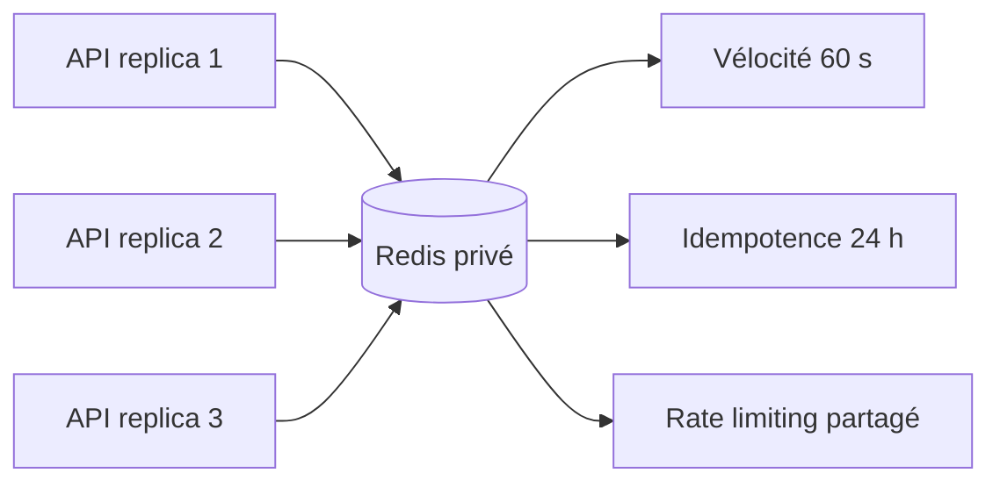
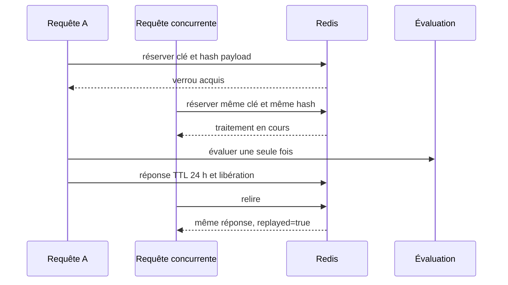
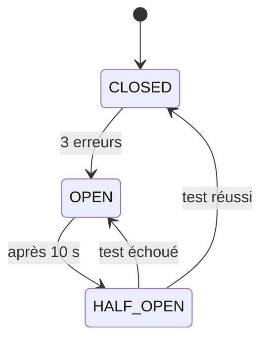

# Résilience et cohérence Redis

## Rôle dans le système

Redis est l'état temporaire commun à tous les replicas API. Il garantit trois propriétés qui
seraient fausses avec une mémoire locale :

1. toutes les instances voient la même vélocité pour une carte ;
2. une demande rejouée ou envoyée simultanément n'est évaluée qu'une fois ;
3. le rate limiting compte globalement les requêtes de tous les replicas.

Redis n'héberge ni logs, ni piste d'audit, ni décision durable. Les clés expirent automatiquement.
La persistance est désactivée dans l'environnement local de démonstration.

## Protection des identifiants

Un `cardId` ou une `Idempotency-Key` ne devient jamais une clé Redis en clair. Le service calcule un
HMAC-SHA-256 avec `REDIS_HMAC_SECRET`, puis utilise uniquement cette empreinte. Contrairement à un
hash simple, le HMAC empêche de retrouver un identifiant prévisible sans connaître le secret.

Le secret contient au moins 32 caractères, reste dans le gestionnaire de secrets et n'est jamais
journalisé. Sa rotation invalide l'état temporaire existant et doit donc tenir compte du TTL
d'idempotence.

## Vélocité atomique

Une opération Lua unique incrémente le compteur et pose son expiration au premier accès. Deux
requêtes simultanées ne peuvent donc pas perdre une incrémentation. La fenêtre est fixe : une
transaction tardive ne prolonge pas le TTL initial.

| Paramètre                  | Valeur initiale | Rôle                             |
| -------------------------- | --------------: | -------------------------------- |
| `VELOCITY_WINDOW_SECONDS`  |          `60 s` | durée du compteur partagé        |
| `VELOCITY_MAX`             |             `3` | maximum avant la règle de risque |
| `REDIS_COMMAND_TIMEOUT_MS` |        `250 ms` | budget d'une opération Redis     |

## Idempotence distribuée

Le client fournit `Idempotency-Key`. Le service conserve l'empreinte du payload, un verrou court et
la réponse terminée.

- même clé et même payload : réponse originale rejouée sans nouvelle vélocité ;
- même clé et payload différent : `409 idempotency_conflict` ;
- appels identiques concurrents : une seule évaluation, les autres attendent ;
- échec de l'évaluation : verrou libéré pour permettre une nouvelle tentative ;
- réponse : TTL initial de 24 heures ; verrou : TTL initial de 5 secondes.

Des scripts Lua finalisent ou libèrent un verrou uniquement pour son propriétaire. Une instance ne
peut pas effacer le verrou repris par une autre après expiration.

## Panne et circuit breaker

Redis a un timeout de 250 ms. Après trois erreurs, le circuit s'ouvre pendant 10 secondes. Une seule
requête `HALF_OPEN` teste ensuite le rétablissement.

Sans Redis, supposer une vélocité nulle pourrait approuver une transaction risquée. Retourner
uniquement `503` serait sûr mais inutilement indisponible. La politique **fail-safe** choisie est :

- décision forcée à `REVIEW` ;
- score au moins égal à `30` ;
- `degraded: true`, raison `RISK_CONTEXT_UNAVAILABLE` et header `X-Degraded-Mode: true` ;
- aucune décision `APPROVED` lorsque l'état partagé est indisponible.

`/health` reste à `200` car le processus fonctionne. `/ready` reste à `200` avec `status: degraded`
car l'instance produit encore une décision sûre. Pendant l'arrêt gracieux, `/ready` passe à `503`.

Le rate limiting utilise le même état partagé. En cas de panne, il bascule vers un compteur mémoire
borné par replica : la protection reste active, mais sa portée globale est temporairement réduite.
Cette situation incrémente `rate_limit_fallback_total` et accompagne le mode de décision dégradé.

## Observabilité

Les transitions du circuit et la perte ou le retour de Redis produisent des événements structurés
sans payload ni identifiant bancaire. Les métriques dédiées sont :

- `shared_state_errors_total` ;
- `degraded_decisions_total` ;
- `redis_circuit_transitions_total{from,to}`.
- `rate_limit_fallback_total`.

## Preuves automatisées

Les tests unitaires couvrent circuit, timeout, single-flight, conflits, TTL et mode dégradé HTTP. La
CI démarre un vrai Redis et vérifie aussi :

- le compteur atomique partagé entre plusieurs stores ;
- l'expiration réelle ;
- la concurrence distribuée et le replay 24 heures ;
- l'absence des identifiants bruts dans les clés.
- le compteur de rate limiting partagé et pseudonymisé.

Ces tests s'exécutent avec `REDIS_TEST_URL`. Ils sont explicitement sautés en local si Redis est
absent, mais jamais dans la CI qui fournit systématiquement ce service.

## Limites

- La fenêtre fixe est volontairement plus simple qu'une fenêtre glissante.
- Le mode dégradé ne remplace pas une véritable file de revue humaine.
- Préserver les replays pendant une rotation HMAC demanderait une stratégie à deux clés.
- Un déploiement réel impose Redis privé, TLS et authentification.
