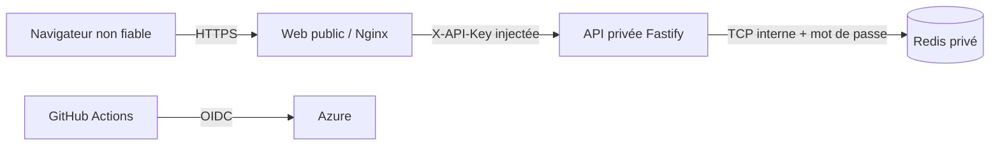

# Sécurité de l'API

## Frontières de confiance

Le navigateur ne connaît jamais `X-API-Key`. Le serveur web l'injecte lors du proxy vers l'API
privée. Cette clé authentifie un service, pas un utilisateur : elle ne fournit ni compte, ni rôle,
ni consentement. L'API ne doit donc pas être exposée directement sur Internet.

Les secrets sont injectés par GitHub/Azure, absents de l'image et du dépôt, puis masqués par la
redaction des logs. Les clés sont comparées via SHA-256 et `timingSafeEqual`.

Le Redis conteneurisé de cet exercice est isolé par l'ingress interne et authentifié, mais n'offre
pas de TLS applicatif. Cette limite économique est déclarée ; une production bancaire utiliserait
Azure Managed Redis avec TLS et private endpoint.

## Validation et limites

| Contrôle              | Politique initiale                                          |
| --------------------- | ----------------------------------------------------------- |
| corps HTTP            | JSON, maximum 16 KiB                                        |
| identifiants métier   | schéma strict, longueurs bornées, champs inconnus refusés   |
| `X-Request-Id`        | 1 à 64 caractères sûrs ; valeur invalide rejetée            |
| `Idempotency-Key`     | 8 à 128 caractères sûrs ; conflit de payload en `409`       |
| token de charge       | 32 à 256 caractères, interdit en production                 |
| paramètres de requête | refusés sur le contrat v1                                   |
| chemin                | segment limité à 64 caractères                              |
| sockets               | timeouts explicites et 1 000 requêtes maximum par connexion |

Un payload trop grand retourne `413`, une entrée incorrecte `400` et une clé interservice absente ou
fausse `401`. Les messages ne répètent jamais les valeurs reçues.

## Rate limiting

Les routes `/api/*` sont limitées par adresse cliente observée. En cloud, un seul proxy de confiance
est déclaré explicitement ; une chaîne arbitraire de proxies n'est jamais acceptée.

- profil public : 60 requêtes par minute ;
- profil de charge : jusqu’à 1 000 000 requêtes par minute avec `X-Load-Test-Token` valide ;
- profil de charge disponible uniquement en intégration ou préproduction ;
- `/health`, `/ready` et `/metrics` restent accessibles à la supervision.

Le compteur est partagé dans Redis et sa clé IP est pseudonymisée par HMAC. Pendant une panne, une
limite locale bornée reste active sur chaque replica. La protection n'est jamais désactivée ;
`rate_limit_fallback_total` rend sa portée temporairement réduite visible. Une limitation à
l'ingress reste recommandée comme défense supplémentaire.

## Headers et données

Les réponses imposent `Cache-Control: no-store`, `X-Content-Type-Options: nosniff`,
`X-Frame-Options: DENY`, `Referrer-Policy: no-referrer` et une Content Security Policy restrictive.
CORS n'est pas activé : le navigateur parle au web public, pas directement à l'API privée.

Les logs n'incluent jamais corps, headers, `cardId`, `transactionId`, clés d'idempotence ou secrets.
Une seconde barrière Pino de redaction est testée sur de vraies lignes JSON. Redis ne voit que les
empreintes HMAC des identifiants.

`GET /api/decisions` n'existe pas : une liste globale exposerait les résultats d'autres visiteurs et
serait incohérente entre replicas. L'historique de démonstration restera dans la session du
navigateur.

## Menaces et réponses

| Menace                       | Réponse                                                        |
| ---------------------------- | -------------------------------------------------------------- |
| brute force interservice     | rate limiting avant authentification, métrique et log de refus |
| rejeu ou double soumission   | idempotence Redis et conflit `409`                             |
| fuite d'identifiants         | HMAC Redis, logs génériques, tests de redaction                |
| payload volumineux ou lent   | limite 16 KiB, timeouts et recyclage des sockets               |
| falsification de corrélation | format strict de `X-Request-Id`                                |
| panne Redis                  | circuit breaker, `REVIEW` fail-safe et limite locale de repli  |
| secret Azure longue durée    | fédération OIDC GitHub vers Azure                              |
| substitution d'artefact      | images scannées rechargées puis promotion par digest           |
| candidat cloud défaillant    | smoke test, rollback automatique et workflow maintenu rouge    |

## Limites assumées

La v1 ne possède pas d'authentification utilisateur, de WAF ni de rotation dynamique des clés. L'API
doit rester privée. La rotation sans interruption et une limitation globale à l'ingress sont des
améliorations de production documentées, pas des garanties simulées.
